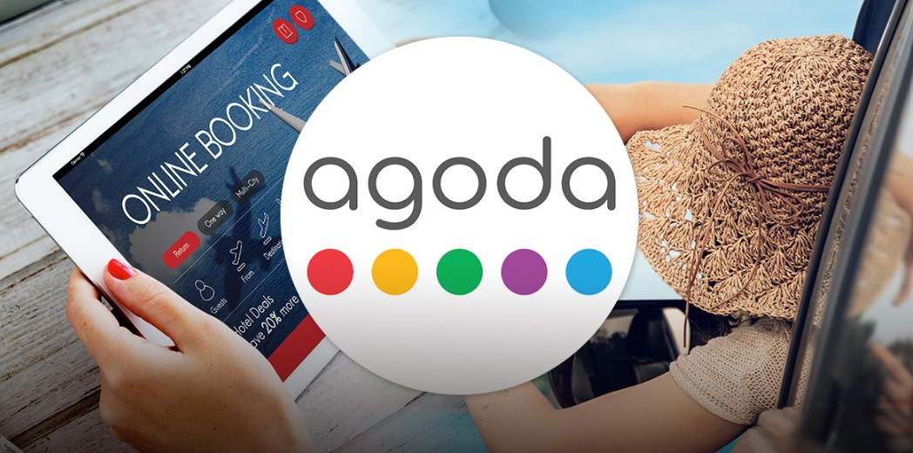
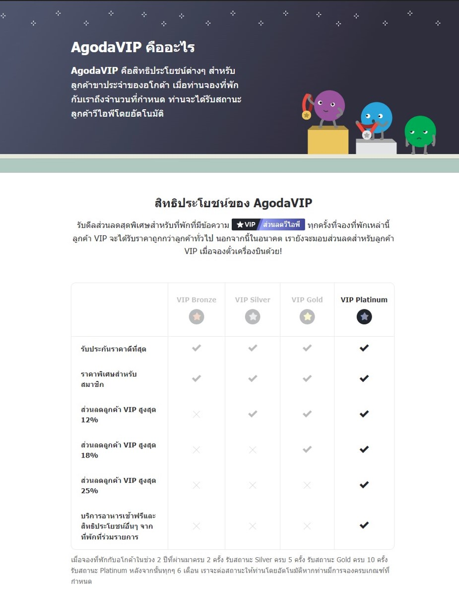
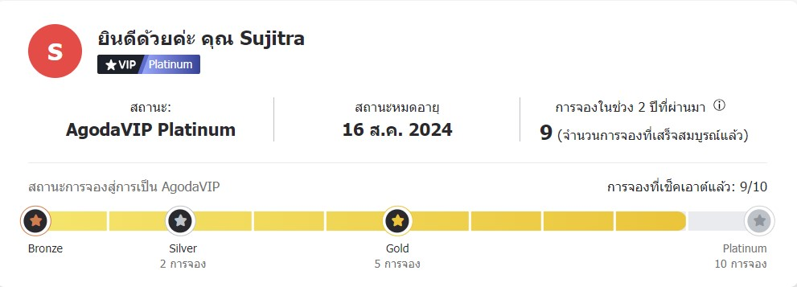
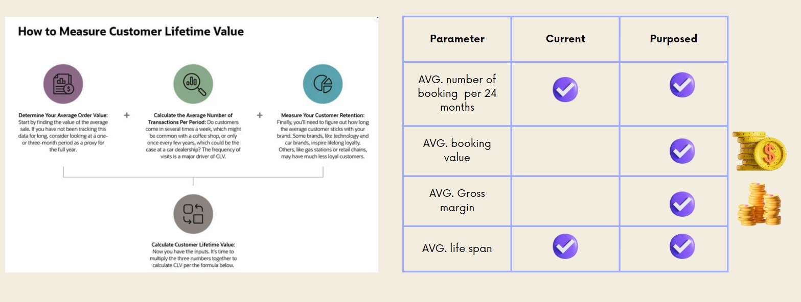
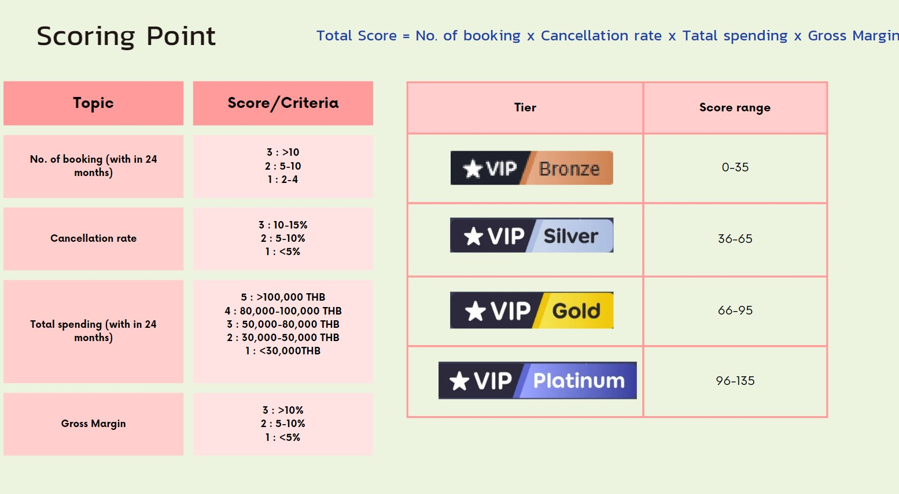

# Customer Lifetime Value
  

The objective is to identify a business, analyze its existing customer, and recommended new CLV Model
## Agoda : Online Travel Agency

"Agoda " is an online travel agency and booking platform that specializes in offering discounted hotel rooms, vacation rentals, and other accommodations. Agoda provides a user-friendly website and mobile app that allow travelers to search for and book accommodations in various destinations around the world. 

## Current agoda Royalty Program
Scoring from : Frequency booking in last 2 years & Cancellation rate

## Improve Customer Lifetime Value
**Addition 2 Features to calculate and rescoring**

1. Average Booking Value / Amount of spending
2. Average Gross Margin 

## Re-Arrangement Customer Royalty Tier
Calculated New Score 
Score = Total Score = No. of booking x Cancellation rate x Total spending x Gross Margin

## Expectation
Segment customer by CLV score and set up different marketing campaign to the customer if CLV score is high we can give them more benefit such as
Referral Bonuses, Birthday and Anniversary Offers, Special Event Reward, Exclusive Partner Offers
