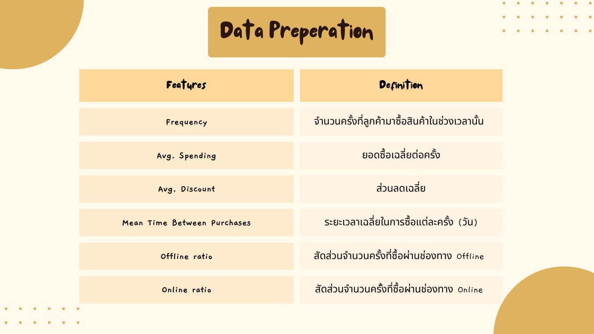

# Customer Segmentation and Product Recommendation
  

# Project objective

# Data Preparation/Feature Selection

# K-Mean Clustering
Use "elbow method" to determine the optimal number of clusters (K) for K-means clustering. The idea behind this method is to run the K-means algorithm for a range of K values and calculate the within-cluster sum of squares (WCSS) for each K. WCSS measures the variance within each cluster, and a lower WCSS indicates that the data points are closer to the centroids within their clusters, suggesting better clustering.
result k = 4

# Customer Segmentation
Customer segmentation based on behavior separated to 4 clusters

# Customer Segmentation (Proportion)

# Customer Segmentation Movement
Visualized by Sankey diagram

# EDA TOP Rank product distribution

# EDA Distribution Product item count by user

# Genearte Association Rule

-using Apriori technique 
: algorithm for market basket analysis, where it helps identify patterns of co-occurrence among products in shopping baskets.

**Define Parameters** 

: minimum support = 0.1

: minimum threshold = 1

: lifting > 1.05

: Confident > 0.4

