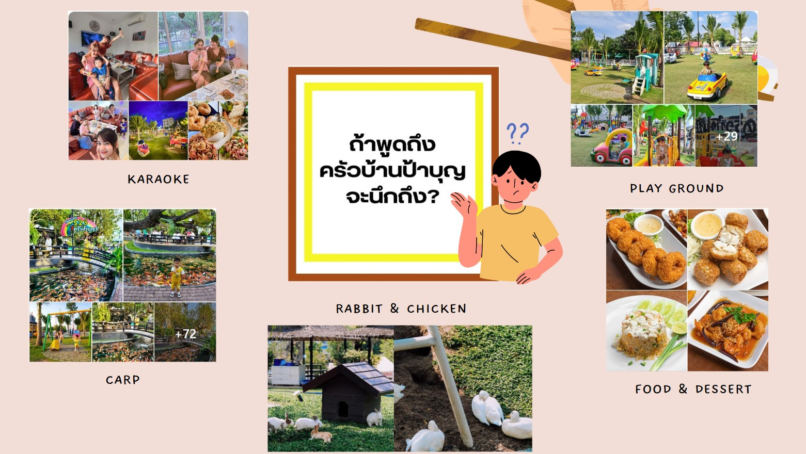
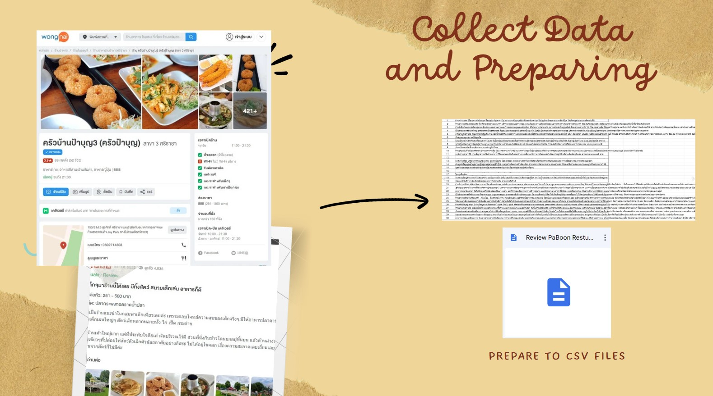
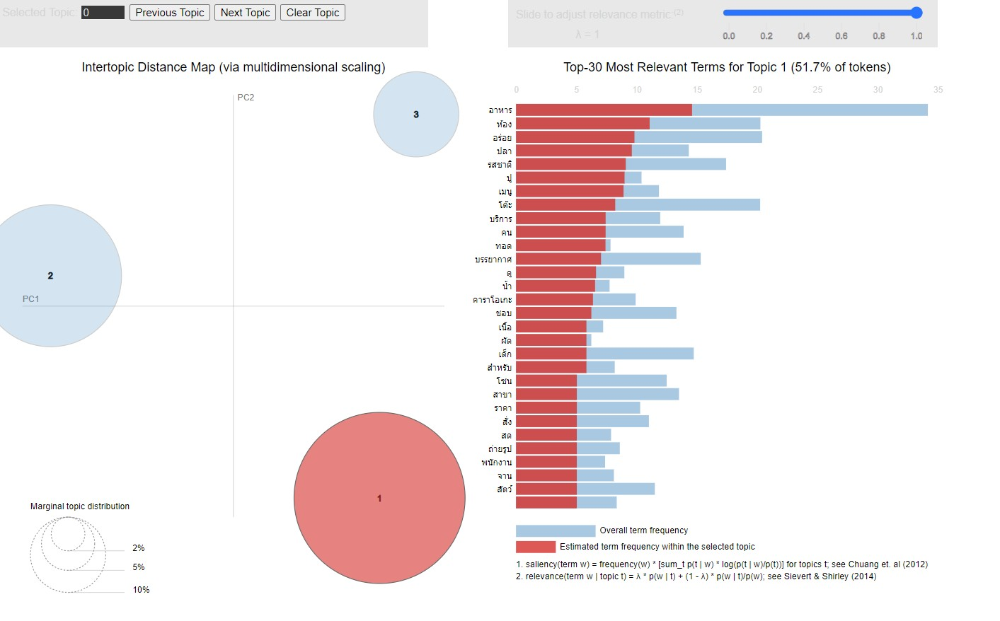
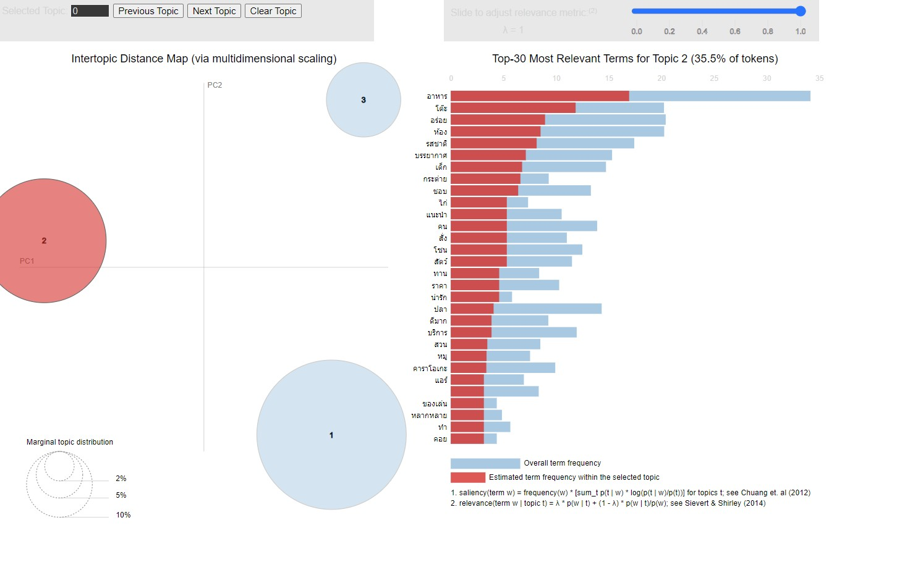
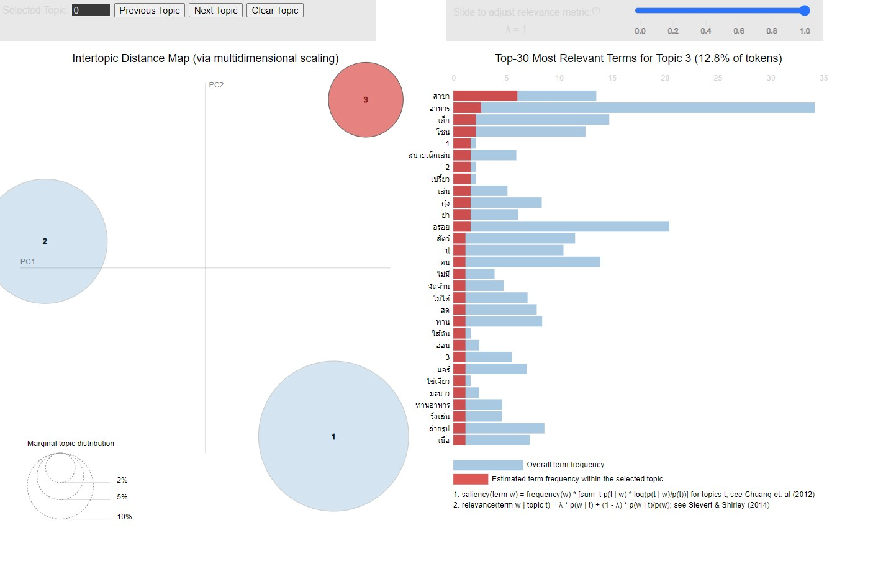
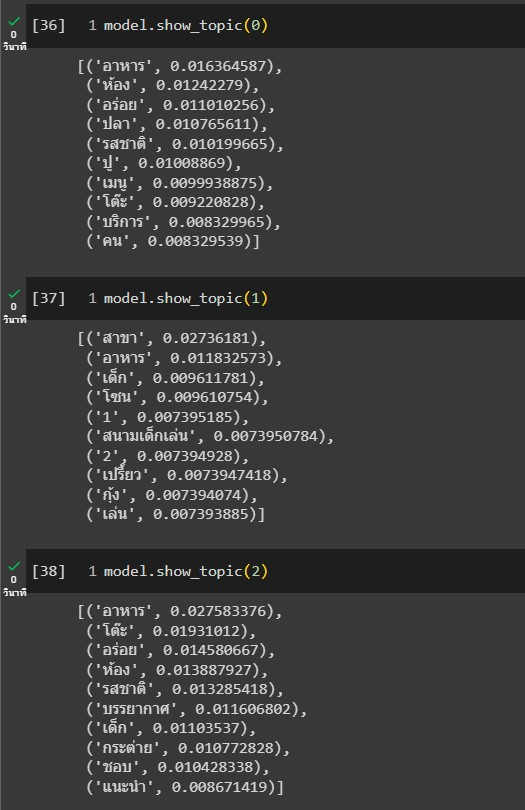

# Voice of Customer Analytics
    

# Overview
This project revolves around analyzing Wongnai reviews for the restaurant named "Pa Boon," situated in Sriracha, Chonburi. With its reputation spanning across Chonburi, this restaurant has established over 5 branches. The Sriracha branch, operational for a year now, prompts an exploration into customer feedback regarding their perceptions and sentiments towards "Pa Boon." Leveraging Natural Language Processing (NLP) techniques, we aim to glean insights from a sample of 30 comments sourced from Wongnai's platform.

# Collect data
Collect data (text) and prepare to CSV file

# Text Processing
- Removing stopwords and meaningless words
- Sentence and Word tokenization (using pythainlp)
- Do topic modeling by using LDA (Latent Dirichlet Allocation) model 
  (LDA is a popular algorithm for topic modeling, which is used to discover hidden thematic structures in a collection of documents)
- Visualization by using **pyLDAvis**

# Results

**Topic1**

**Topic2**

**Topic3**

**Topic Detail**

**Word Cloud**

